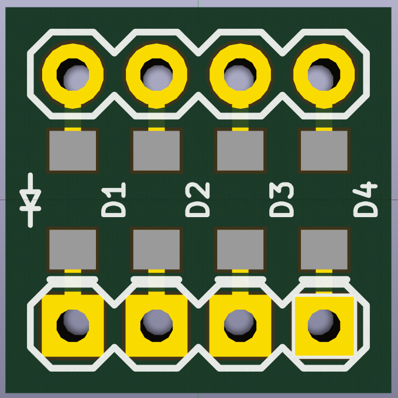
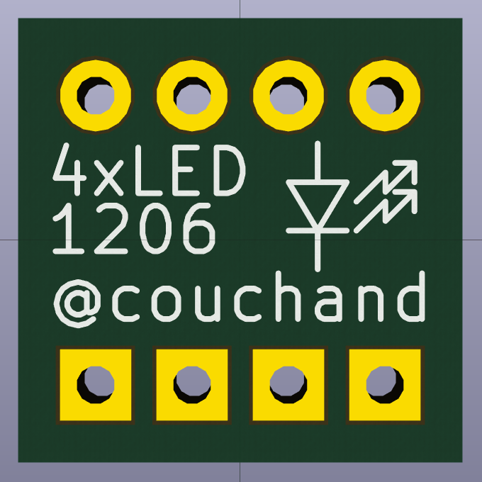

1206 Breakout
=============

This is a tiny little breakout board for four 1206 LEDs.  If you solder
male headers to it, it's breadboard-compatible.  Use it to prototype
projects you're building using 1206-size SMD LEDs.  Current-limiting
resistors not included.

Files are in KiCad format.

Front
-----

Back
----

